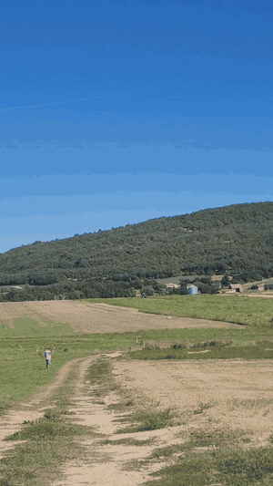
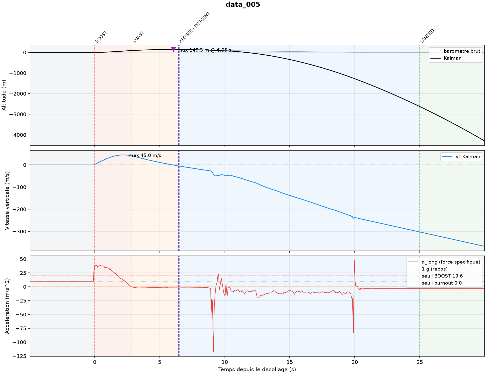
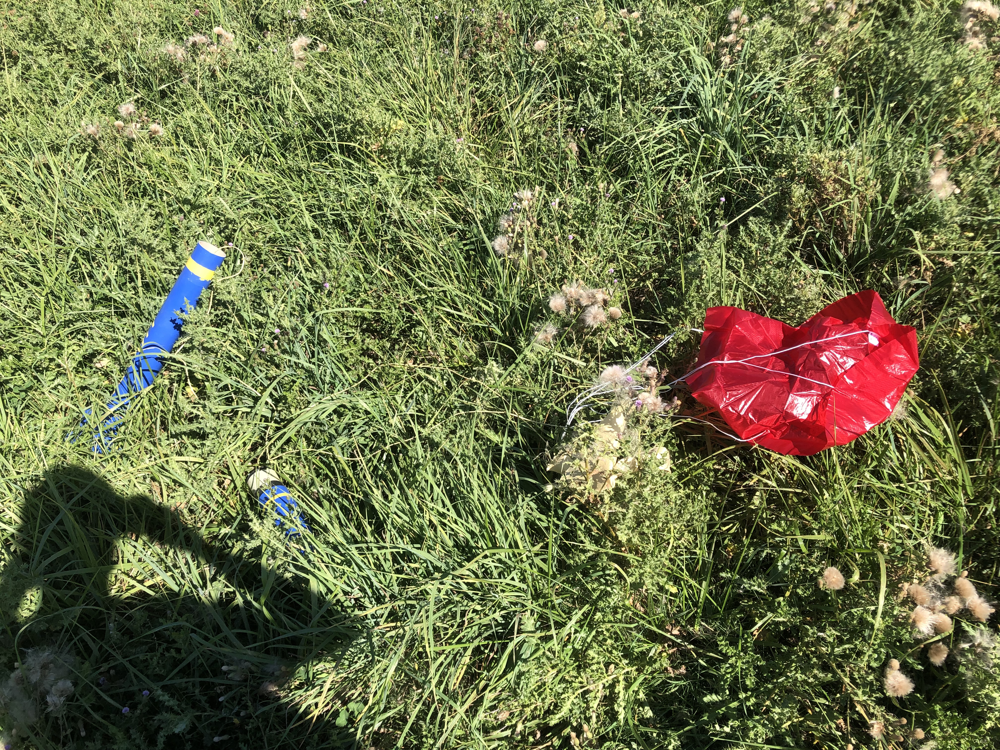

# LUNATIK

A flight computer we designed, built and flew in a our model rocket, to find out which way of detecting apogee really fires first: the barometer, the accelerometer, or both fused with a Kalman filter.



**[Watch the full flight](video-first-flight-LUNATIK.mp4)** | **[Schematic (PDF)](Schematic_LUNATIK-v1.pdf)** | **[Try the ground station without a rocket](#try-it-without-a-rocket)**

Raspberry Pi Pico 2 (RP2350), CircuitPython, LoRa telemetry, SD logging. Made by Sidonie and me (Gabriel), two high school students from Villeneuve-lès-Avignon, France, for the French Physics Olympiad (Olympiades de Physique France).

## Why we built it

Most hobby flight computers detect apogee the same way: wait until the altitude drops a few samples in a row, then fire the parachute. I wanted to know if that actually works, and how late it is.

The whole project ended up fitting in one sentence: **the accelerometer is a good clock but a bad ruler, and the barometer is a good ruler but a bad clock.**

- Integrate an accelerometer twice and any tiny bias `b` becomes an altitude error of `1/2 b t^2`. Great for the first second, useless after ten.
- A barometer knows where you are, but to be sure you've passed the top you have to wait until you're `dh` below it. That costs `sqrt(2 dh / g)` seconds, however good the sensor is.

So LUNATIK fuses both with a 3-state Kalman filter (altitude, vertical velocity, accelerometer bias), and we measured whether that is actually better instead of assuming it.

## It flew

LUNATIK flew in September 2026. The GIF at the top is the liftoff, and the full clip is in the repo: [`video-first-flight-LUNATIK.mp4`](video-first-flight-LUNATIK.mp4).


## What's on the board


| Part | Job |
|---|---|
| Raspberry Pi Pico 2 (RP2350) | runs everything, in CircuitPython |
| BMP388 (I2C) | pressure, so altitude |
| LSM6DSO32 (I2C) | accelerometer +/-16 g and gyro, 208 Hz |
| RFM9x LoRa 868 MHz (SPI) | telemetry to the ground |
| SD card module (SPI) | full flight log in CSV |
| NEO-6M GPS (UART) | position, to find the rocket afterwards |
| TP4056 + LiPo | charging and power |
| TPS61023 boost | 5 V for the SD card |
| 3700 Hz buzzer | so you can hear what state it's in |
| 10k/22k divider + 100 nF | battery voltage on the ADC |

Schematic done in EasyEDA by both of us.

## How it works

**State machine.** `PRE_LAUNCH -> BOOST -> COAST -> APOGEE -> DESCENT -> LANDED`. Every transition needs several confirming samples and has a backup timer, because we only had one motor and the firmware had to work the first time.

**Kalman filter.** The 3x3 covariance is stored as 6 plain floats instead of a matrix, so no numpy and no allocation on the Pico. The full update costs 0.51 ms. The process noise isn't the datasheet value: it has to cover gravity leaking into the axis when the rocket tilts, which the model doesn't know about.

**Apogee.** We first tried "N decreases in a row" and threw it out after measuring it. Near apogee the rocket drops about 4 cm between two samples, while the noise on that difference is about 24 cm. The signal-to-noise ratio is 0.18, so the criterion is basically flipping a coin. LUNATIK instead fires when the *fused* altitude is 0.51 m (3 sigma of the baro noise) below the highest point seen, confirmed twice.

**Radio off during the climb.** One LoRa packet blocks the loop for about 200 ms. In simulation, leaving it on during the climb made the altitude error go from 0.21 to 0.54 m, so the radio stays quiet from liftoff to apogee.

## Numbers

Measured on the real board, except the two lines marked "sim" (OpenRocket trajectory with realistic noise added).

| | |
|---|---|
| Loop rate during the climb | 32.3 Hz |
| Barometer read (OSx8) | 21.4 ms, 69 % of the loop |
| Full Kalman update | 0.51 ms, 1.6 % of the loop |
| Baro noise, measured | 15.7 cm |
| Kalman altitude uncertainty | 8.7 cm (1.8x better than the raw baro) |
| Apogee detection delay (sim) | 0.37 +/- 0.02 s |
| Lead over the motor's ejection charge (sim) | 0.188 s |

The one that surprised me: the maths costs almost nothing. The barometer eats most of the loop, so optimising the filter would have been pointless. Reading pressure and temperature in one call instead of two took the loop from 19 Hz to 32 Hz.

## Things that went wrong

- **The SD card was wired to VBUS on the V3 board.** It worked perfectly on the bench, because the bench was on USB. On battery, in flight, it would have been dead. We only caught it by writing a script to check the Gerbers before ordering. The new board powers it through the TPS61023 boost.
- **The burnout threshold was never crossed.** We took it from OpenRocket's "vertical acceleration" column, but that column doesn't include gravity, and an accelerometer measures gravity plus acceleration. The rocket always switched to COAST on the 5 s backup timer, 2.3 s late. Now the threshold is compared to the real sensor value (column + 9.81).
- **Apogee fired on the launch pad.** Feeding the detector raw baro altitude, noise alone crossed the threshold before liftoff in 2 runs out of 5. Feeding it the Kalman altitude fixed it.
- **Still open:** under the parachute the rocket swings, gravity leaks into the accelerometer axis, and the filter becomes overconfident (1.5 m of real error for 8.5 cm announced). Fixing that means adding attitude from the gyro, so going from 3 states to at least 6.

## The flight
 
LUNATIK flew in September 2026 and logged the whole thing to SD at about 30 Hz. This is the raw log, straight from the card:
 

 
| | |
|---|---|
| Apogee | 140 m, 6.1 s after liftoff |
| Peak acceleration | 4.0 g, top speed 45 m/s |
| Liftoff detected | 63 ms after the first sample above 2 g (needs 3 in a row) |
| Burnout detected | 2.9 s after liftoff, on the sensor threshold, not the backup timer |
| Apogee called by LUNATIK | **0.45 s after the top** (simulation said 0.37 s) |
| Motor ejection charge | 2.5 s after LUNATIK called apogee, 24 m lower |
| Descent under parachute | 9.3 m/s |
| Landing detected | 5 s after touchdown, as designed |
 
The result I care most about: the motor's delay charge opened the parachute 2.5 s after the top, with the rocket already 24 m down. LUNATIK knew it was at apogee half a second after the top. On this flight, electronic deployment would have opened the chute a lot earlier and higher.
 
**What went wrong in the air.** Look at the blue curve after the parachute opens. Under the chute the rocket hangs upside down, so the accelerometer reads about -10 m/s^2 instead of +10. The filter still subtracts its +9.81 bias, sees 20 m/s^2 of acceleration that doesn't exist, and drifts. Once it was more than 30 m off, the innovation gate (there to protect the filter from one bad baro reading) started rejecting *every* baro reading, so it never came back. It ended the flight thousands of meters underground.
 
Two lessons: a gate needs a way back (reset on the barometer after too many rejections), and the model needs attitude, or at least needs to stop trusting the accelerometer under the chute. The good news is that landing detection runs on the raw barometer, not on the filter, so the state machine still called LANDED correctly.
 
<p align="center">
  
</p>

## Try it without a rocket

The ground station has a simulation mode that generates fake telemetry, so you can see it running with no hardware:

```bash
git clone https://github.com/gabriel84-py/fus-e_code.git
cd fus-e_code/scripts
pip install pyserial matplotlib
python dashboard.py --simulate
```

Needs Python 3 with Tkinter (included with the python.org installer on Windows and macOS; `sudo apt install python3-tk` on Debian/Ubuntu).

To run the real thing: flash CircuitPython on a Pico 2, copy everything in `src/` to the `CIRCUITPY` drive, and format the SD card as FAT32 (full format, not quick). On the pad, the accelerometer bias shown on the debug line has to settle near **+9.81**. If it goes to -9.81 the axis is upside down and the rocket will never detect liftoff.

## About the logged hours

Hackatime only tracked the code. Everything on the hardware side (soldering, wiring, building and integrating the rocket, launch day) wasn't recorded, because I didn't know there was a tool to record build sessions until the rocket had already flown. So the hours on this project are lower than the time I actually spent on it.

## Credits

- Adafruit for the CircuitPython drivers, OpenRocket for the trajectory simulations.
- Olympiades de Physique France, and Hack Club for Stardance.